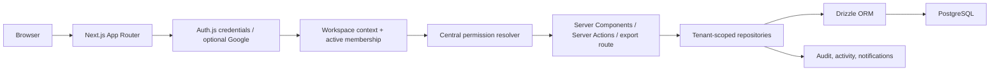

# NEFE Enterprise Architecture Blueprint (EH0)

Status: repository-grounded baseline  
Date: 2026-07-31  
Scope: architecture documentation only

## Executive conclusion

NEFE is a Next.js 16 modular monolith backed by PostgreSQL through Drizzle. It has a credible application-layer multi-tenant foundation: the authenticated session identifies a user, the active membership is resolved server-side, permissions are centralized, business repositories scope records by organization, and sensitive multi-write collaboration and decision operations use transactions. Evidence includes [`auth.ts`](../../auth.ts), [`app/lib/auth/workspace-context.ts`](../../app/lib/auth/workspace-context.ts), [`app/lib/auth/permissions.ts`](../../app/lib/auth/permissions.ts), [`app/lib/data`](../../app/lib/data), and [`db/schema.ts`](../../db/schema.ts).

The architecture is suitable for a **small, controlled pilot only after the pre-pilot gates in this blueprint are met**. It is not enterprise-ready today. The largest blockers are session invalidation and recovery gaps, process-local registration throttling, absence of verified staging/CI/backup-restore operations, application-only tenant enforcement, broad workspace queries, and limited production observability.

## Evidence labels

- **Implemented** — directly verified in repository source.
- **Partial** — implemented, but incomplete for the stated operating level.
- **Inferred** — reasonable interpretation, not a deploy-time fact.
- **Missing** — no repository evidence.
- **Recommended** — target architecture; not current behavior.

## Current architecture

## Maturity snapshot

| Area | Rating | Current position |
|---|---|---|
| Application structure | 3/5 | Coherent modular monolith; domain boundaries are emerging |
| Authentication | 2/5 | Secure password hashing and cookies; recovery, MFA and revocation missing |
| Authorization | 3/5 | Central RBAC and tenant predicates; no database RLS or systematic integration proof |
| Data integrity | 3/5 | Foreign keys, indexes, transactions and migrations; several relationship/model gaps |
| Reliability | 1/5 | Error UI exists; no verified SLOs, backup drills, incident process or job durability |
| Scalability | 2/5 | PostgreSQL indexes and bounded connection pool; broad workspace hydration will not scale |
| Mobile/API readiness | 1/5 | No stable shared-client API or mobile session contract |
| Pilot readiness | 2/5 | Product workflow exists; operational controls must be proven before onboarding |

## Target architecture

Remain a modular monolith through pilot and early scale. Add explicit domain services, a versioned shared-client API, durable background work, measured query optimization, and operational controls incrementally. Do not introduce microservices, a graph database, external search, or distributed caching before measurements justify them.

## Recommended sequence

1. EH1 — Authentication and Session Hardening.
2. EH2 — Authorization and Tenant Isolation.
3. EH3 — Data Integrity and Database Hardening.
4. EH4 — API and Shared-Client Foundation.
5. EH5 — Performance and Scalability.
6. EH6 — Background Jobs and Event Reliability.
7. EH7 — Observability, Backup and Disaster Recovery.
8. EH8 — Security Testing and Adversarial Validation.
9. EH9 — Pilot Readiness.
10. EH10 — Production Acceptance.

## Required answers

1. **Controlled pilot?** Conditionally yes, for 3–5 organizations, after EH1–EH3 and the pilot operations gate.
2. **Not enterprise-ready because?** Authentication lifecycle, defense-in-depth tenancy, operational reliability, formal API contracts, and production evidence are incomplete.
3. **Must resolve before onboarding?** Session/recovery controls, authorization tests, migration/restore procedure, staging, alerting, rate limiting, and production fixture checks.
4. **May monitor during pilot?** Query tuning beyond observed bottlenecks, external search, distributed cache, and advanced integration throughput.
5. **Scale now?** Measure and reduce workspace fan-out, add query pagination, validate indexes, bound payloads and test pilot load.
6. **Premature scale work?** Microservices, graph database, Redis, Kafka, and dedicated search cluster.
7. **Modular monolith?** Yes, through pilot and early regional validation.
8. **Formal API timing?** Before native mobile or third-party integrations; introduce an authenticated versioned façade, not a rewrite.
9. **Before mobile?** Stable API, token lifecycle, device/session revocation, error contracts, pagination, observability and release policy.
10. **Learn from pilots?** Executive versus operational workflows, offline needs, notification value, field-device constraints and highest-frequency tasks.
11. **Infrastructure for 3–5 pilots?** Isolated production and staging databases, managed hosting, secret management, restore-tested backups, logs/alerts, migration gates and support runbooks.
12. **Before Commercial Graph?** Stable entity identity, relationship provenance, temporal validity, data quality, tenant policy and relational query baselines.
13. **Before meaningful AI?** Governed data, deterministic baselines, evaluation datasets, human approval, explainability, privacy classification and monitoring.
14. **Founder approval?** Items marked “Requires founder decision” in the [decision register](21-architecture-decisions.md).
15. **Next Codex prompt?** The focused EH1 scope in the [roadmap](20-enterprise-readiness-roadmap.md#eh1-authentication-and-session-hardening).

## Documents

- [Current state](00-current-state.md)
- [Architecture principles](01-architecture-principles.md)
- [Security architecture](02-security-architecture.md)
- [Authentication and sessions](03-authentication-and-sessions.md)
- [Authorization and tenant isolation](04-authorization-and-tenant-isolation.md)
- [API and client architecture](05-api-and-client-architecture.md)
- [Data and database architecture](06-data-and-database-architecture.md)
- [Scalability and performance](07-scalability-and-performance.md)
- [Background jobs and events](08-background-jobs-and-events.md)
- [Caching and search](09-caching-and-search.md)
- [Observability and reliability](10-observability-and-reliability.md)
- [Infrastructure and environments](11-infrastructure-and-environments.md)
- [Backup and disaster recovery](12-backup-and-disaster-recovery.md)
- [CI/CD and release management](13-ci-cd-and-release-management.md)
- [Pilot infrastructure](14-pilot-infrastructure.md)
- [Mobile backend strategy](15-mobile-backend-strategy.md)
- [Integration platform](16-integration-platform.md)
- [Commercial Graph foundation](17-commercial-graph-foundation.md)
- [AI readiness](18-ai-readiness.md)
- [Security and load-testing toolchain](19-security-and-load-testing-toolchain.md)
- [Enterprise-readiness roadmap](20-enterprise-readiness-roadmap.md)
- [Architecture decisions](21-architecture-decisions.md)
- [Risk register](22-risk-register.md)
- [Claude expansion and review packets](23-claude-expansion-and-review-packets.md)

